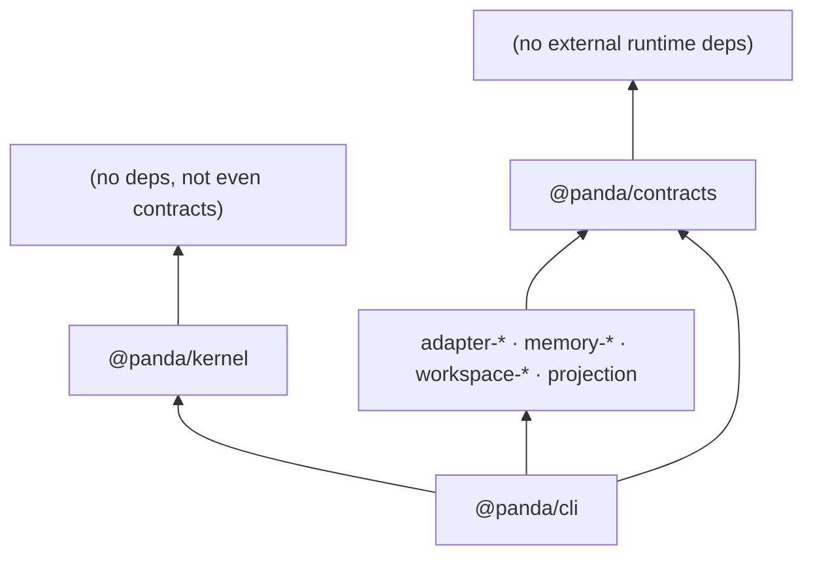

# Architecture Spine — Panda v1

## Design Paradigm

**Microkernel + ports.** The Kernel is a generic service container (lifecycle, dependency injection, scoped event bus, layered config). The seven v1 Contracts are standalone ports. Everything else — adapters, providers, engines, the CLI itself — mounts as plugins around it. Even consumer-facing orchestration is a plugin: nothing in the Kernel knows a concrete Contract.

```mermaid
flowchart TD
    K["@panda/kernel<br/>(container: lifecycle · DI · event bus · config layers)"]
    C["@panda/contracts<br/>(7 ports + typed errors + schema interfaces)")
    A["adapters / memory / workspace / projection<br/>(plugins implementing ports)"]
    CLI["@panda/cli"]
    X["Executors (external CLIs)<br/>claude · codex · opencode"]

    A -->|implements| C
    CLI --> K
    CLI --> C
    CLI --> A
    K -.->|"never imports"| C
    A <-->|"spawn/drive (out-of-process)"| X
```

## Invariants & Rules

### AD-1 — Microkernel paradigm

- **Binds:** all
- **Prevents:** core growing privileged knowledge of any Contract or implementation; "plugin" in name only.
- **Rule:** the Kernel is generic. It loads Plugins declaring provided/consumed services via manifest, resolves their graph, owns lifecycle. No Kernel module imports `@panda/contracts` or any implementation package. [ADOPTED]

### AD-2 — Package topology & dependency direction

- **Binds:** repository layout, publishing, third-party integrators
- **Prevents:** dependency-rule-by-lint-discipline; contract consumers forced to install the kernel; version coupling between independent implementations; runtime service graphs that contradict package topology.
- **Rule:** packages by role with strictly-downward imports:



Third parties implement any port installing only `@panda/contracts`. All Contracts version together under one semver major (PRD §11). **Runtime consumption mirrors this topology**: derived-state generators (projection engine, Bundle export) may consume only canonical-state inputs — Registry read-ports and resolved config. Memory and other side-state are reachable solely through explicit consumer-facing surfaces, never as implicit inputs to derived artifacts. [ADOPTED]

### AD-3 — Plugin trust model

- **Binds:** plugin loading, security posture
- **Prevents:** silent privilege assumptions; premature IPC serialization complexity.
- **Rule:** Plugins are trusted code loaded in-process (dynamic ESM import); installing one is executing it — documented at the install surface. Real isolation boundaries are structural: Executors are out-of-process, Tools cross process lines via MCP, secrets never enter the projection path. Port methods are async-compatible so a worker offload of one plugin remains possible without breaking consumers. [ADOPTED]

### AD-4 — State ownership

- **Binds:** F3 Registry/Projection, F4 Memory, F5 Workspaces, F6 Bundles
- **Prevents:** two writers to any owned state; derived state treated as truth; untraceable mutations; silent lost updates across processes.
- **Rule:** the Registry is THE canonical mutable store. Its canonical entry envelopes (tool/skill/mcp-server/profile) — schemas and validation point — are defined in `@panda/contracts` and enforced by the Registry service at registration; provider-specific payloads live only under a reserved `extensions` namespace. Registry write serialization is **machine-scoped**: an advisory lock keyed to the physical store path binds every writer (concurrent CLIs, embedded SDKs alike), contending writers receive a typed error naming the holder. Projections are derived artifacts written only by the projection engine, atomically (temp-file + rename), as a pure function of canonical-state inputs. Vendor configs are modified exclusively through ProjectionTarget merges; foreign content preserved byte-for-byte. **All persistent mutations of panda-owned state** — Registry entries, panda-owned config keys, projections — flow exclusively through their owning component's serialized API; direct filesystem writes to panda-owned files by plugins are prohibited and detected by doctor. The observability log is a **kernel-owned core service initialized before any plugin loads**, with a fixed failure policy (typed degraded mode, never silent loss); every model-visible interaction must be reconstructable from it. [ADOPTED + tightened by adversarial review H1/H3/H4/H8]

### AD-5 — Injection semantics

- **Binds:** Kernel DI, all Plugins
- **Prevents:** silent undefined propagation; kernel crashes from plugin failures.
- **Rule:** hard-consumed services block readiness until provided. Soft reads yield a typed-absent value whose use-site MUST raise an explicit `not-configured` error naming the service. An individual plugin's startup failure emits a contained event; the kernel and other plugins keep running. [ADOPTED]

### AD-6 — Identity & naming

- **Binds:** workspaces, worktrees, lineages, registry entries, bundles
- **Prevents:** caller-chosen ID collisions; path-reuse corruption; ownership-by-heuristic; dual-authority over materialized entities.
- **Rule:** durable IDs derive from content hashes over canonical identity inputs (e.g. sha256(workspace identity ‖ target identity)). Released workspace/worktree names are retired permanently. Ownership is proven by durable metadata records written at creation — never inferred from paths. For entities materialized outside the Registry (workspaces/worktrees), the **on-disk record is the creation-of-record**; Registry mirroring occurs within the same serialized transaction as record creation, and a defined recovery sweep reconciles both after a crash. [ADOPTED + tightened H2]

### AD-7 — Error model

- **Binds:** all Contracts, all packages
- **Prevents:** naked errors crossing boundaries; untestable failure modes.
- **Rule:** one typed error hierarchy with stable string codes lives in `@panda/contracts`. Every Contract violation raises a coded error naming the violated clause; contract-test suites assert on codes. [ADOPTED]

### AD-8 — Event bus discipline

- **Binds:** Kernel event bus, listeners, disposal/shutdown flows
- **Prevents:** listener cascade failures; ordering ambiguity; torn lifecycle transitions.
- **Rule:** dispatch is synchronous, ordered fan-out within scope (`global | project | agent`); handlers may be async and are contained per-listener — one rejection never breaks siblings. **Lifecycle-transition events** (dispose/release/shutdown/swap) join all handler continuations before the transition completes; handlers MUST NOT emit events synchronously during fan-out; shutdown drains pending handler mutations before unwinding registrations. No cross-event reentrancy guarantee in v1. [ADOPTED + tightened H6]

### AD-9 — Config layering & sentinel grammar

- **Binds:** config resolution, projection inputs, drift detection
- **Prevents:** ad-hoc merge order; invisible overrides; unclassifiable config sections.
- **Rule:** resolution walks defaults → global → project → agent → invocation overlay, deep-merging with sentinels for panda-owned keys; a dump command exposes the composed tree with originating layer per key. Narrower scopes never mutate wider-scope files. **`@panda/contracts` owns a single versioned, namespaced sentinel grammar** (`PANDA:<v>:…` family) covering BOTH the layered-config vocabulary and the vendor-config projection markers as explicitly distinct systems; ProjectionTargets implement only per-format encodings of that grammar; sentinels from unknown/legacy versions classify as Drift requiring explicit migration. [ADOPTED + tightened H7]

### AD-10 — Tool-call interception waterfall

- **Binds:** Kernel plugin container, every Plugin exposing or invoking executor-side actions
- **Prevents:** budget rules living in prompts; unbounded loops/fan-out; post-hoc cost enforcement.
- **Rule:** the Kernel exposes a tool-call interception pipeline (pre → guard → around → post) through which every executor-action invocation flows; token budgets, loop caps, and fan-out limits are enforced exclusively at this seam as declarative policy — never by prompt instruction. Policy violations raise coded errors from AD-7's hierarchy.

## Consistency Conventions

| Concern | Convention |
| --- | --- |
| Naming | Packages `@panda/<role>`; ports `XProvider`/`XAdapter`/`XTarget`/`XSource`; events past-tense (`executor.exited`); error codes `PANDA_<DOMAIN>_<REASON>` |
| Data & formats | IDs are content-hash hex; timestamps ISO 8601 UTC; results are typed envelopes (`{status, data, summary, changedPaths?, errors?}`); schemas cross Contract boundaries as Standard Schema v1 objects |
| State & cross-cutting | Mutations serialized through owning component; atomic writes everywhere (temp+rename); secrets never logged/bundled/serialized into errors; logs append-only |
| Liveness detection | ExecutorAdapter responsibility only; native-config hooks are injected EXCLUSIVELY through the projection engine's owned merge path (never direct writes); passive PTY/OSC fallback; screen scraping prohibited |
| Credentials | Credential-mode safety policy is validated at config-resolution time (AD-9 domain): unsafe modes for the detected environment are refused with a typed error naming mode + opt-in flag |

## Stack

| Name | Version |
| --- | --- |
| TypeScript (compiler/typecheck) | 7.0.x (native); second alias restores bare `tsc` |
| TypeScript (lint tooling peer, aliased `@typescript/typescript6`) | 6.0.x |
| Node.js | >= 24 LTS (Krypton) |
| pnpm | 11.x |
| Schema interface | Standard Schema v1 (Zod 4.x allowed inside implementations/tests only) |
| Test runner | Vitest 4.x |
| Lint | ESLint 10 + typescript-eslint (against TS6 alias) |
| Release machinery | @changesets/cli ^3 (ESM-only; Node ^22.11 \|\| ^24 \|\| >=26) |

## Structural Seed

```text
panda/
  packages/
    kernel/            # @panda/kernel — container, zero runtime deps
    contracts/         # @panda/contracts — 7 ports, errors, schema interfaces
    adapter-claude/    # first-party ExecutorAdapter plugins
    adapter-codex/
    adapter-opencode/
    memory-fs/         # MemoryProvider impl
    memory-sqlite/     # MemoryProvider impl
    workspace-local/   # WorkspaceProvider impl
    workspace-git/     # git-worktree WorkspaceProvider impl
    projection/        # projection engine + ProjectionTarget traits table
    cli/               # @panda/cli binary
  .scratch/            # references, scratch analysis (gitignored)
```

Deployment envelope (v1): local-first SDK + globally installable CLI; no server, no cloud component. Distribution via npm registry; CI runs contract suites against all first-party implementations on Node 24 (+26 canary).

## Capability → Architecture Map

| Capability | Lives in | Governed by |
| --- | --- | --- |
| F1 Kernel & lifecycle | @panda/kernel | AD-1, AD-5, AD-8, AD-9 |
| F2 Executor adapters | adapter-* packages | AD-3, AD-6, AD-7; traits-as-data rule (PRD FR-8) |
| F3 Registry & projection | @panda/contracts + projection | AD-4, AD-9; ownership sentinels (PRD FR-12) |
| F4 Memory providers | memory-* packages | AD-4, AD-7; append-only provenance (PRD RD-1) |
| F5 Workspaces | workspace-* packages | AD-6; PRD FR-17..FR-20 |
| F6 Portability (Bundles) | @panda/contracts + cli | AD-4, AD-6; secret exclusion (PRD FR-21) |
| F7 Method contract | @panda/contracts definition | AD-7; PRD RD-3 |
| F8 CLI | @panda/cli | composes all; budgets from PRD §12 |

## Deferred

- **Durability engine choice** — v-next (Workers/Workflows); the seam is fixed now: four-primitive contract over a bring-your-own-store TS-native engine.
- **Plugin worker isolation** — conditional on dogfooding evidence; AD-3 keeps the door open.
- **SSH WorkspaceProvider implementation** — contract already wide enough (orca study); implement when demand lands.
- **Terminal shell** — future consumer plugin; no architectural commitment made here beyond port async-compatibility.
- **Quota-aware routing policies** — v-next; RD-4 bounds v1 to read-only surfacing.
- **Workers & Workflows execution doctrine** — single-writer default and deterministic-workflow-by-default (brief constraints 1–2) are BINDING for the v-next design; no v1 surface may preclude them.
- **Portable worker-class card** (brief constraint 6) — defined in the v-next Workers design; v1's ExecutorAdapter + traits table must not hardcode role semantics that would block it.
- **Secrets vault integrations** — opt-in channel spec belongs to architecture-of-record for security; start at build time if dogfooding demands.
